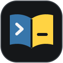
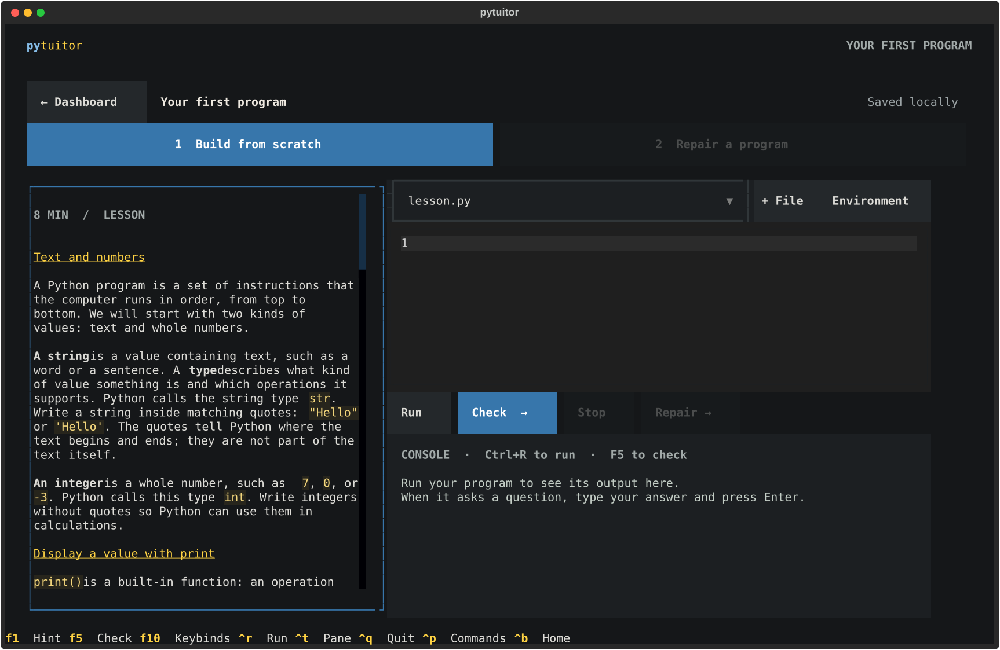

<p align="center">
  
</p>
<h1 align="center">Pytuitor</h1>
<p align="center"><strong>Learn Python by building it and fixing it.</strong><br>
Guided lessons, real projects, and immediate feedback in your terminal.<br>
Offline, with no account required.</p>
<p align="center">
  <a href="#start-learning">Start learning</a> ·
  <a href="#preview">Preview</a> ·
  <a href="docs/curriculum.md">Curriculum</a> ·
  <a href="#development">Development</a> ·
  <a href="https://github.com/dboyza/pytuitor/issues">Report an issue</a>
</p>
<p align="center"><strong>75 lessons</strong> &nbsp; / &nbsp; <strong>12 projects</strong> &nbsp; / &nbsp; <strong>21 chapters</strong></p>

## Start learning

For Windows 10/11, macOS, and Linux, with [uv](https://docs.astral.sh/uv/getting-started/installation/) installed and a terminal at least **80 × 24**.
Initial setup may download Python 3.11+ and dependencies; learning works offline afterward.
On Windows, use Windows Terminal with Windows PowerShell 5.1 or PowerShell 7; the commands below work in both.

```sh
git clone https://github.com/dboyza/pytuitor.git
cd pytuitor
uv run --locked pytuitor
```

Already have the checkout?
Run the last command from its root.
On the welcome screen, select **Start learning** for your first lesson or **Browse syllabus** to explore.

**Release candidate:** Pytuitor is not yet published to PyPI.
See [installation and upgrades](docs/install.md) for a standalone wheel installation or help recovering a broken environment.

## Preview

<a href="docs/assets/learning.svg"></a>

*Read the lesson, write your code, and check the result in one workspace.*

## Learn by doing

Start as a complete beginner or deepen your existing Python knowledge.

- **Build, then repair.**
  Write a program from scratch, then debug a broken one; complete both stages to finish the unit.
- **Get useful feedback.**
  Run code with interactive input and compare checked results with expected behavior.
  Use hints or explicitly reveal a reference solution when you get stuck.
- **Choose your path.**
  Follow the course or skip known topics when continuing; prerequisites guide you without locking lessons.
- **Keep your progress.**
  Separate Build and Repair drafts are saved locally so you can pick up where you left off.

### A course that grows with you

The 21 chapters span five sections.
The first three form the core sequence; the last two offer optional depth.

| Section | What you will explore |
| --- | --- |
| Foundations | Values, input, decisions, collections, loops, and functions |
| Everyday Python | Files, structured data, regular expressions, and library tools |
| Building programs | Modules, classes, tests, and automation |
| Python depth | Python-specific behavior, composition, and object protocols |
| Specialized topics | Async programming, distribution, and language machinery |

See the [curriculum map](docs/curriculum.md) for chapters, projects, and preparation.

<details>
<summary><strong>Keyboard shortcuts</strong></summary>

| Key | Action |
| --- | --- |
| **Ctrl+T** | Cycle through lesson, editor, and console, including in small terminals |
| **Ctrl+R** | Run your program |
| **F5** | Check your work |
| **F10** | Open all keybinds |
| **Ctrl+P** | Open commands, including export, reset, and project tools |

When your program asks a question, type in the console and press **Enter**.

</details>

For separate profiles, multi-file projects, exports, resets, and optional environments, see [workspace behavior](docs/workspaces.md) and [installation](docs/install.md).
Learner code runs locally with resource limits; subprocesses and virtual environments are not an operating-system security sandbox.

## Development

### Repository layout

```text
pytuitor/
├── src/pytuitor/           Textual application and learning engine
│   ├── app.py              Application shell
│   ├── lesson_screen.py    Build/Repair workspace and console
│   ├── curriculum.py       Assembled course catalog
│   ├── lessons/            Authored lesson explanations
│   └── theme.tcss          Terminal layout and styling
├── tests/                  Curriculum, execution, state, and UI journeys
├── scripts/                Installed-wheel checks and release tooling
├── docs/                   Curriculum, guides, and README assets
├── pyproject.toml          Package metadata and development tools
└── uv.lock                 Locked dependencies
```

### Run the checks

From the repository root:

```sh
uv sync --locked
uv run pytest
uv run ruff check .
uv run ruff format --check .
uv build
```

See the [release checklist](docs/release-checklist.md) for installed-wheel validation and the [learner study guide](docs/learner-study.md) for evaluating the teaching experience.

## Next steps

- **Keep learning:** explore the [curriculum](docs/curriculum.md) and choose your next chapter.
- **Contribute:** start with [development](#development), then use the [release checklist](docs/release-checklist.md) to validate a change.
- **Get help:** [open an issue](https://github.com/dboyza/pytuitor/issues) with your launch command, terminal, and the error or lesson involved.
